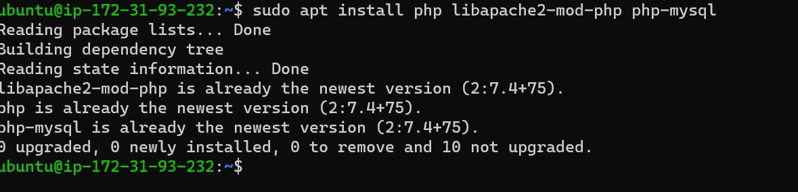

**Oluwatosin Project-1 Documentation**

*I already ran all these codes and they were all successful but for documentation sake, had to start all over*

### Step 1

`sudo apt update`

`sudo apt install apache2`

`sudo systemctl status apache2`

`curl http:54.82.102.98:80`
*italicized text*

`http:54.82.102.98:80`

### Step 2
*I already installed mysql hence the image result*

### Step 3
*I already have PHP installed hence the image result*

### Step 4
*I already have the directory renamed hence the image result*

